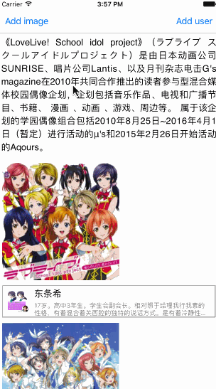

## Custom RichTextView Belong to UITextView

Write a rich text view editor easily.



## CoacoPods

TODO

## How to use

1. Create your attachment object.

 ```objc
@interface DDImageAttachmentObject : DDAttachmentObject
@property (strong, nonatomic) UIImage *image;
@end
```

2. Return your attachment view matched attachment object.

 ```objc
- (DDAttachmentReusableView *)textView:(DDAttachmentTextView *)textView attachmentViewWithAttachment:(DDTextAttachment *)attachment {
    if ([attachment.data isKindOfClass:[DDImageAttachmentObject class]]) {
        DDImageAttachmentView *view = [textView dequeueReusableAttachmentViewWithIdentifier:@"image"];
        view.imageView.image = ((DDImageAttachmentObject *)attachment.data).image;
        return view;
    }
    return nil;
}
```

3. That's all!

## LISENCE

MIT